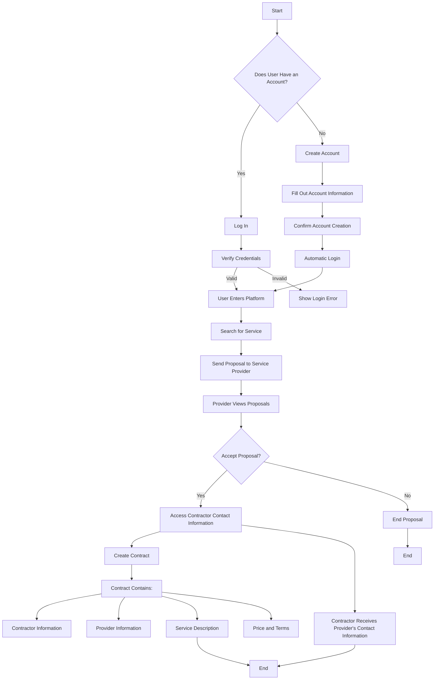

# Trabalho Amigo - Community service sharing platform

**Our project connects people who need services to professionals who can offer them. The platform allows users to find providers in different areas, from simple tasks to specialized services. Professionals are evaluated by clients, ensuring safe and reliable hiring. Thus, we facilitate the meeting between those looking for a service and those available to provide it.**

> [!IMPORTANT]
> **The project is not yet complete**, as it is currently in the development phase as part of a course conclusion work. We are focused on building the core functionalities and validating the viability of the platform. The current version serves as a prototype, and future expansions and improvements are planned for when the project is at a more advanced stage, including interface optimizations, integration of new services and improvement of evaluation and security tools for users.

# Steps to install the project
**To configure the project locally, follow the steps below:**

## 1. Prerequisites
**Before you begin, make sure you have the following tools installed on your system:**

[](https://git-scm.com/)
[](https://www.apache.org/)
[](https://code.visualstudio.com/)
[](https://www.mysql.com/)

## 2. Cloning the Repository
**Open the terminal and run the command to clone the project repository:**
``` bash
  git clone https://github.com/vitorgabrieldevk/trabalhoamigo.com.br
```

## 3. Starting Server
**With Apache turned on and the MySQL server running, import the database from the file: 'Database.sql'**
``` sql
  mysql -u root -p trabalhoamigo < /path/para/Database.sql
```
> [!NOTE]
> Replace '/path/para/Database.sql' with the path where the file is located, if you are using the `Xampp` server, it will be
> ``` sql
>   mysql -u root -p trabalhoamigo < C:/xampp/htdocs/trabalhoamigo.com.br/Database.sql
> ```

## 4. Running the project
``` bash
   composer install
```

**Now just open the url in your browser:**
``` bash
  localhost/trabalhoamigo.com.br/
```



## Tecnologias Utilizadas

| Aonde?        | Qual?                                                                                               |
|-------------------|-----------------------------------------------------------------------------------------------------|
| **Backend**       | [](https://www.php.net/) |
| **Frontend**      | [](https://developer.mozilla.org/pt-BR/docs/Web/HTML)  <br> [](https://developer.mozilla.org/pt-BR/docs/Web/CSS) <br> [](https://developer.mozilla.org/pt-BR/docs/Web/JavaScript) |
| **Database**| [](https://www.mysql.com/)  |
| **Web Server**  | [](https://httpd.apache.org/)  |

#

> [!WARNING]
> **Due to some problems during development, we did not implement a responsive web version, therefore, it is not possible to access the prototype via cell phone at the moment. We want to expand this experience to a webview App system and a more intuitive and responsive interface so that mobile users can access**.

#

## Collaborators:

<table>
  <tr>
    <td align="center">
      <a href="#" title="defina o título do link">
        <br>
        <sub>
          <b>Vitor Gabriel</b>
        </sub>
      </a>
    </td>
    <td align="center">
      <a href="#" title="defina o título do link">
        <br>
        <sub>
          <b>João Victor</b>
        </sub>
      </a>
    </td>
    <td align="center">
      <a href="#" title="defina o título do link">
        <br>
        <sub>
          <b>Maria Eduarda</b>
        </sub>
      </a>
    </td>
    <td align="center">
      <a href="#" title="defina o título do link">
        <br>
        <sub>
          <b>Thaynna Carolliny</b>
        </sub>
      </a>
    </td>
    <td align="center">
      <a href="#" title="defina o título do link">
        <br>
        <sub>
          <b>Layla Beatrice</b>
        </sub>
      </a>
    </td>
  </tr>
</table>
