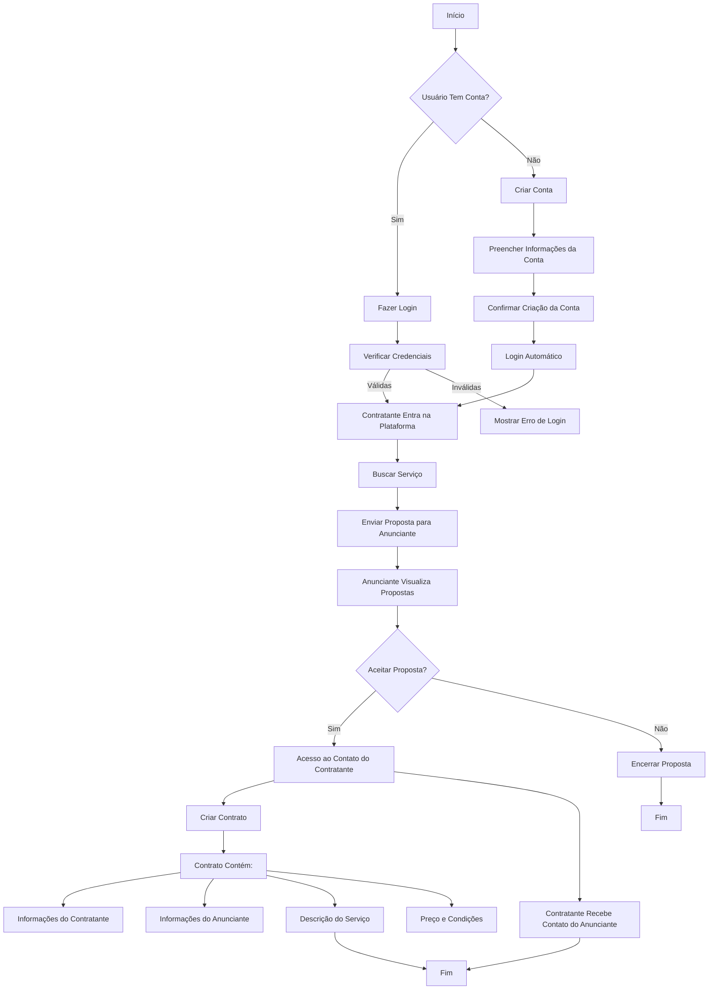

# Trabalho Amigo - Plataforma de compartilhamento de serviços entre comunidade

**Nosso projeto conecta pessoas que precisam de serviços a profissionais que podem oferecê-los. A plataforma permite que os usuários encontrem prestadores de diversas áreas, desde tarefas simples até serviços especializados. Os profissionais são avaliados pelos clientes, garantindo uma contratação segura e confiável. Assim, facilitamos o encontro entre quem busca um serviço e quem está disponível para realizá-lo.**

> [!IMPORTANT]
> **O projeto ainda não está completo**, pois no momento está em fase de desenvolvimento como parte de um trabalho de conclusão de curso. Estamos focados em construir as funcionalidades principais e validar a viabilidade da plataforma. A versão atual serve como um protótipo, e futuras expansões e melhorias estão planejadas para quando o projeto estiver em estágio mais avançado, incluindo otimizações na interface, integração de novos serviços e aprimoramento das ferramentas de avaliação e segurança para os usuários.

# Passos para instalção do projeto
**Para configurar o projeto localmente, siga as etapas abaixo:**

## 1. Pré-requisitos
**Antes de começar, certifique-se de ter as seguintes ferramentas instaladas em seu sistema:**

[](https://git-scm.com/)
[](https://www.apache.org/)
[](https://code.visualstudio.com/)
[](https://www.mysql.com/)

## 2. Clonando o Repositório
**Abra o terminal e execute o comando para clonar o repositório do projeto:**
``` bash
  git clone https://github.com/vitorgabrieldevk/trabalhoamigo.com.br
```

## 3. Iniciando Servidor
**Com o apache ligado e o servidor mysql em execução, realiza a importação do banco de dados pelo arquivo: 'Database.sql'**
``` sql
  mysql -u root -p trabalhoamigo < /path/para/Database.sql
```
> [!NOTE]
> Substitua o '/path/para/Database.sql' para o caminho no qual se encontra o arquivo, caso esteja usando servidor `Xampp`, será
> ``` sql
>   mysql -u root -p trabalhoamigo < C:/xampp/htdocs/trabalhoamigo.com.br/Database.sql
> ```

## 4. Rodando o projeto
> [!NOTE]
> Não é necessário rodar nenhum comando de instação como yarn, npm ou composer, visto que não há dependências externas.

**Agora basta abrir em seu navegador a url:**
``` bash
  localhost/trabalhoamigo.com.br/
```



## Tecnologias Utilizadas

| Aonde?        | Qual?                                                                                               |
|-------------------|-----------------------------------------------------------------------------------------------------|
| **Backend**       | [](https://www.php.net/) |
| **Frontend**      | [](https://developer.mozilla.org/pt-BR/docs/Web/HTML)  <br> [](https://developer.mozilla.org/pt-BR/docs/Web/CSS) <br> [](https://developer.mozilla.org/pt-BR/docs/Web/JavaScript) |
| **Banco de Dados**| [](https://www.mysql.com/)  |
| **Servidor Web**  | [](https://httpd.apache.org/)  |

#

> [!WARNING]
> **Decorrente de alguns problemas durante o desenvolvimento, não implementamos uma versão web responsiva, portanto, não é possível acessar o prótipo pelo celular no momento, queremos expandir essa experiência para um sistema de webview App e uma interface mais intuitiva e responsiva para que usuário mobile possam acessar**.

#

## Colaboradores:

<table>
  <tr>
    <td align="center">
      <a href="#" title="defina o título do link">
        <br>
        <sub>
          <b>Vitor Gabriel</b>
        </sub>
      </a>
    </td>
    <td align="center">
      <a href="#" title="defina o título do link">
        <br>
        <sub>
          <b>João Victor</b>
        </sub>
      </a>
    </td>
    <td align="center">
      <a href="#" title="defina o título do link">
        <br>
        <sub>
          <b>Maria Eduarda</b>
        </sub>
      </a>
    </td>
    <td align="center">
      <a href="#" title="defina o título do link">
        <br>
        <sub>
          <b>Thaynna Carolliny</b>
        </sub>
      </a>
    </td>
    <td align="center">
      <a href="#" title="defina o título do link">
        <br>
        <sub>
          <b>Layla Beatrice</b>
        </sub>
      </a>
    </td>
  </tr>
</table>
